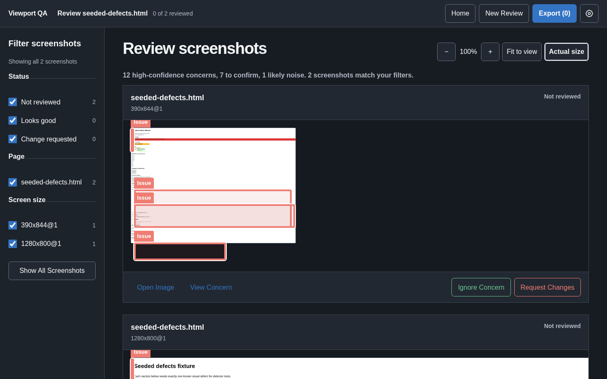

# Viewport QA

Scan a web page at several viewport sizes, catch the layout defects a human would spot, review the screenshots locally, and hand the change requests to a person or an AI agent.



Viewport QA is a local-first CLI. It renders your page in Playwright Chromium at each viewport, runs rule-based detectors over the painted layout (overflow, clipped text, bad wrapping, low contrast, overlapping elements, unreachable controls, missing fonts…), records console errors, failed requests, and storage writes alongside the visual findings, and writes everything to a report directory. `vqa open` then serves a dark review GUI on loopback where you mark each capture **Looks good** or **Change requested**, and export a readable TXT/PDF handoff for people or an integrity-bound JSON bundle for agents.

No accounts, no telemetry, no AI by default.

## Install

Requires Node.js 22 or newer.

```sh
npm install -g viewport-qa
vqa browser install
```

The second command downloads the exact Chromium build that Viewport QA is tested against into its own per-user cache (about 185 MB). Nothing is downloaded during `npm install` itself, and your global Playwright cache is left alone. `npx viewport-qa …` also works if you prefer not to install globally.

## Quick start

```sh
vqa scan https://example.com --viewports 390x844,1280x800 --out ./report
vqa open ./report
```

Your system browser opens the review. Filter by page, viewport, or status; click through full-size screenshots and issue crops; mark captures; write what should change; then **Export** a human or AI handoff.

Don't want a terminal at all? `vqa launch` opens a start page where you type a URL, pick viewports, and scan from the browser.

For a walkthrough of the whole loop see the [quick start](docs/quickstart.md).

## What it finds

**Visual** (rule-based, deterministic, no model needed):

| Detector | Catches |
| --- | --- |
| `page-overflow` | The page scrolls horizontally |
| `element-overflow` | Content spills out of its container |
| `clipped-text` | Text cut off by `overflow: hidden` or a fixed-height box |
| `wrapping` | One-word-per-line columns and forced mid-word breaks |
| `overlap` | Unrelated elements colliding |
| `offscreen-interactive` | Buttons and links positioned outside the reachable viewport |
| `contrast` | Text below WCAG AA contrast |
| `color` | Text nearly indistinguishable from its background |
| `font-rendering` | Requested font failed to load; zero-size text boxes |
| `cramped-spacing` / `excessive-gap` | Blocks touching, or gaps far outside the page's rhythm |

Only painted elements are inspected, so hidden DOM (closed `<select>` options, `display: none`) never produces findings. The same defect at several viewports is presented once with a plain-language range like *fails at 390px, clean at 1280px and above*.

**Behaviour** (captured during the same render):

- Console `error` and `warning` messages
- Requests that failed or returned 4xx/5xx
- Cookie names and attributes, `localStorage`/`sessionStorage` key names — never values

## More than the first paint

- **Named scenarios** — `--scenarios recipe.json` drives the page into labelled states (open a modal, fill a form, stub an API response with `route`) and captures each at every viewport. See the [CLI reference](docs/cli-reference.md#scan) and the [example recipe](docs/examples/scenarios.json).
- **Crawl** — `--crawl` follows same-origin links breadth-first (default 10 pages, depth 2).
- **Baselines** — `vqa baseline ./report` marks a report; a later `scan --baseline ./report` diffs matching captures against it.
- **AI fix suggestions** — `--model-cli claude` or `--model-cli codex` opts in to asking an already-authenticated local CLI for a fix per finding. Off by default; behaviour findings are never sent.

## Commands

| Command | Does |
| --- | --- |
| `vqa scan <url-or-file>` | Render, detect, and write a report directory |
| `vqa open <report>` | Serve the review GUI on loopback and open the browser |
| `vqa serve <report>` | Same, without launching the browser |
| `vqa launch` | Start page for scanning without a terminal |
| `vqa summarize <report>` | Print the compact defect list (`--json` for agents) |
| `vqa baseline <report>` | Mark a report as a comparison baseline |
| `vqa browser status\|install\|repair\|remove` | Manage the pinned Chromium |
| `vqa doctor` | Check Node, platform, cache, and browser health |

Default viewports when `--viewports` is omitted: `360x800, 390x844, 390x844@3, 768x1024, 1280x800, 1440x900, 1920x1080, 2560x1440`. Full options and exit codes are in the [CLI reference](docs/cli-reference.md).

## Security model

Viewport QA treats every scanned page as untrusted and fails closed:

- Local files and loopback targets work out of the box. Any other origin — the target, its redirects, its CDNs — must be listed explicitly with `--allow-origin`, and requests to anything else are blocked before they leave the browser. Private and reserved DNS answers are rejected.
- The review service binds to `127.0.0.1` only, on a random free port, with a per-launch capability token that is never printed or logged. It is not designed to sit behind a proxy.
- Report writes are transactional; a non-empty `--out` directory is refused rather than overwritten.
- Report assets are hash-bound; review state and exports are bound to the manifest they came from.

Details in [security](docs/security.md) and [privacy and data](docs/privacy-and-data.md).

## For agents

`agent-summary.json` is written beside every report and `vqa summarize --json` prints it: one record per grouped defect with severity, confidence, viewport range, screenshot and crop paths, and reproduction coordinates. The [AI consumption contract](docs/AI-CONSUMPTION.md) defines the artifacts, validation order, and trust boundaries. Handoff JSON is data to validate, not instructions to follow.

## Documentation

- [Quick start](docs/quickstart.md) — the full scan → review → handoff loop
- [CLI reference](docs/cli-reference.md)
- [Report formats](docs/report-formats.md) — every file a scan writes
- [Review and handoff](docs/review-and-handoff.md)
- [Browser management](docs/browser-management.md) — cache, proxies, mirrors, offline
- [Troubleshooting](docs/troubleshooting.md)
- [Security](docs/security.md) · [Privacy and data](docs/privacy-and-data.md) · [Reporting a vulnerability](SECURITY.md)
- [AI consumption contract](docs/AI-CONSUMPTION.md)
- [Contributing](CONTRIBUTING.md) — building from source and running the checks

## Status

Version **0.5.0**. Linux x64 is the primary tested platform; macOS and Windows have passed the same test suite in earlier private builds but are not yet exercised in public CI. Report format 3; format-2 reports from earlier versions still open.

## License

[MIT](LICENSE).
